<div align="center">




<br/>

[](https://linkedin.com/in/omar-faruko)
[](https://github.com/o-faruk)
[](mailto:omarfarukk108@gmail.com)

</div>

<div align="center"></div>

## `> whoami`

```yaml
role:       "CS Student @ UConn · AI/ML Concentration · Class of 2028"
focus:      "AI agents, agentic pipelines, full-stack product development"
location:   "Hartford, CT"
education:
  school:   "University of Connecticut"
  major:    "Computer Science"
  concentration: "Artificial Intelligence / Machine Learning"
  grad:     2028
current_work:
  - "JARVIS       — Electron/React/Node.js desktop AI assistant · agentic tool use"
  - "Recall       — Serverless AWS RAG document search · Lambda + Bedrock + DynamoDB"
  - "Youtube      — AI-generated YouTube channel · end-to-end agentic pipeline"
interests:  ["AI Agents", "Local LLMs", "Youtube", "Building cool stuff"]
```

<div align="center"></div>

## `> ls ./projects --active`

**[JARVIS](https://github.com/o-faruk)** — Desktop AI Assistant
> Keyboard-summoned (`Ctrl+Space`) Electron overlay with an agentic tool-use loop. Reads/edits files, drives your real browser over CDP, does cited web research, controls apps, and narrates every step — with cost-aware routing across Claude Haiku / Sonnet / Opus.
 
`Electron` `React` `Node.js` `Anthropic Claude` `Puppeteer` `CDP`
 
---
 
**[Recall](https://github.com/o-faruk)** — Serverless RAG Document Search
> Fully serverless RAG pipeline on AWS. Upload → chunk → embed → query. Semantic search over your own docs with cited answers, backed by Pinecone vectors and Claude-generated responses. Auth via Amazon Cognito.
 
`AWS Lambda` `S3` `DynamoDB` `Pinecone` `Anthropic Claude` `Gemini Embeddings` `React` `AWS Amplify` `Amazon Cognito`

---

**[Weird Internet Rabbit Holes](https://github.com/o-faruk)** — AI YouTube Channel
> End-to-end agentic content pipeline: topic research → script generation → AI voiceover → visuals → edited video. Hosted by a black pixelated MS Paint stick figure. Everything from ideation to upload is orchestrated through Claude Code.
 
`Claude Code` `Python` `Google Whisk` `ElevenLabs` `DaVinci Resolve` `yt-dlp`

---

**[Premier League Match Predictor](https://github.com/o-faruk)**
> Random Forest classifier trained on 1,300+ EPL matches. 68% precision on match outcomes. Feature engineering from Selenium-scraped live stats + Pandas pipelines.

`Python` `Scikit-learn` `Selenium` `Pandas` `Random Forest`


<div align="center"></div>

## `> cat ./stack.json`

<div align="center">

[](https://skillicons.dev)

[](https://skillicons.dev)

[](https://skillicons.dev)

</div>

<div align="center"></div>

## `> btop --user omar`

<div align="center">


</div>

<div align="center"></div>

## `> tail -f ./now.log`

```
[WORK]  JARVIS ................... Electron AI desktop assistant · active
[WORK]  Recall ................... Serverless AWS RAG · active
[WORK]  Youtube .................. AI YouTube channel · pipeline operational
[INFO]  UConn .................... CS + AI/ML · Class of 2028 · Hartford, CT
[LIVE]  Local LLMs ............... qwen2.5-coder:14b + deepseek-r1:14b via Ollama
[WARN]  Sleep schedule ........... undefined....
```

<div align="center"></div>

<div align="center">

<br/>

[](https://github.com/o-faruk)


</div>
